# Chess 3D

A 3D chessboard for the browser. A marble and walnut board with a gold inlay, sculpted Staunton pieces, studio lighting you can switch, and a board you can turn on all three axes. You play a full game of chess against the computer (you start as white on Easy), or switch the computer off and share the screen with another person.

Built with three.js (0.186) and Vite. Everything is procedural: the geometry comes from code, the textures from canvas, and the game loads no image, model or font files while you play. The few PNG files in `public/` (the Home Screen icons and the link preview image) are generated by `tools/render-assets.mjs`, and the screenshots in `docs/` are only for this page.

**Play it:** https://bop-del.github.io/chess-3d/

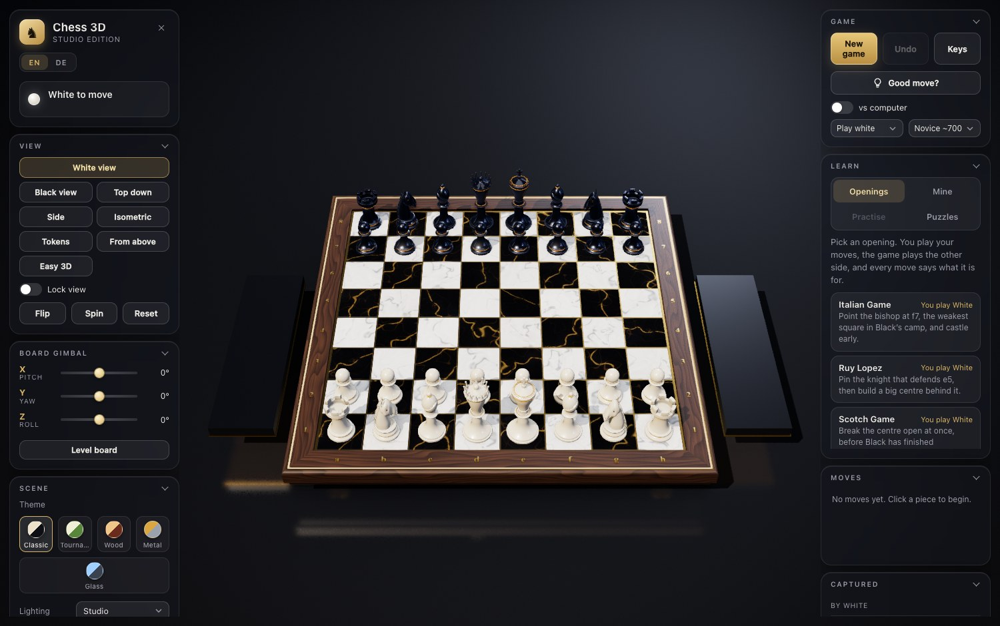

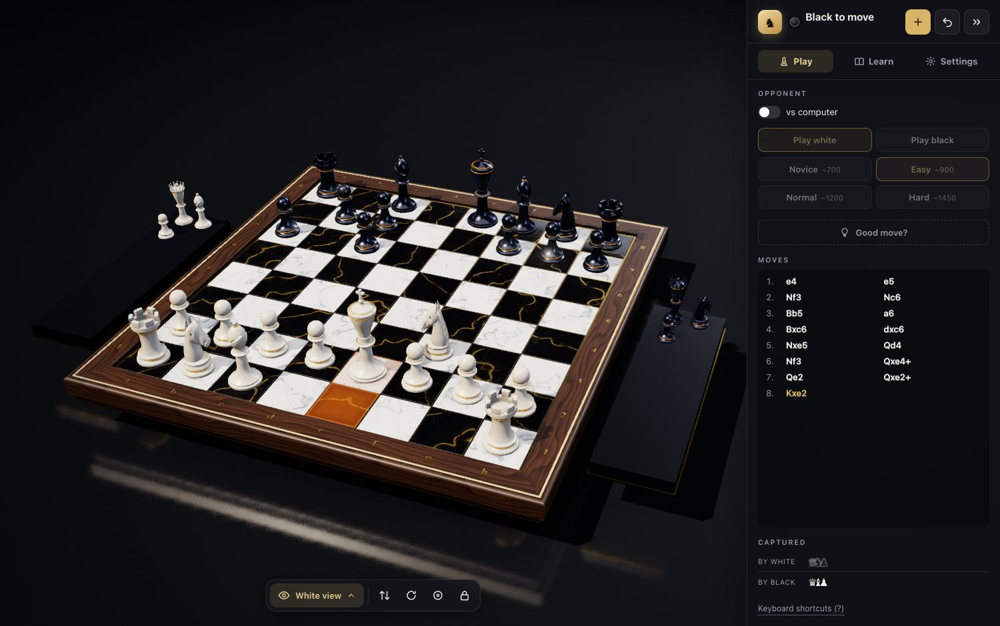

The capture trays: captured pieces lie inside the tray, never overlapping, the most valuable first.

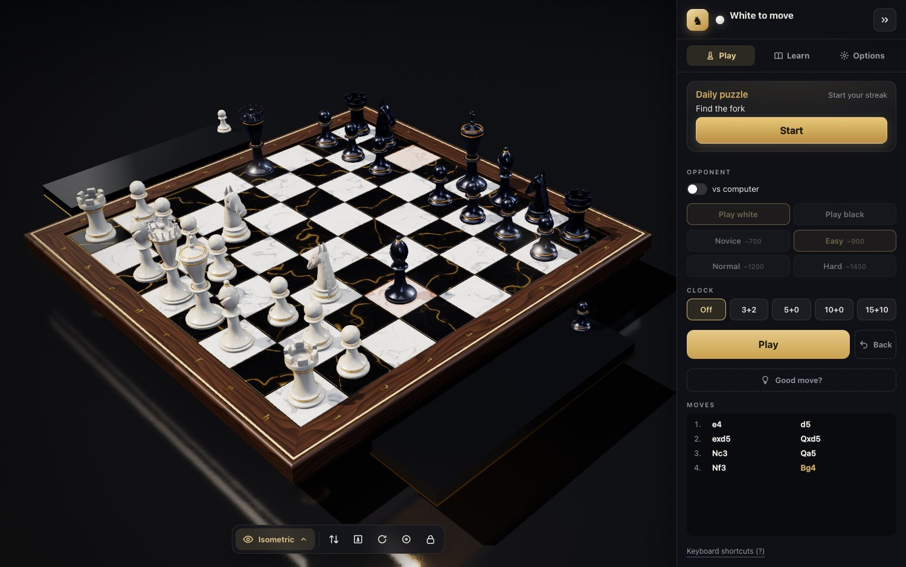

The Spielsteine view (named Tokens in English): a flat top view with every piece as a thick gold turned disc.

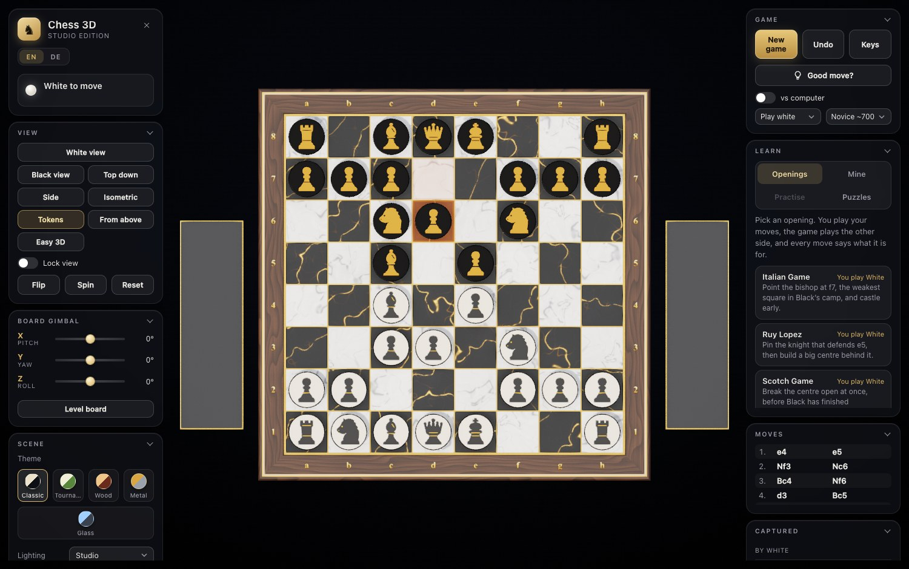

The Puzzles tab: a path of ten stations per chapter, gold for a clean solve, silver for one that needed help.

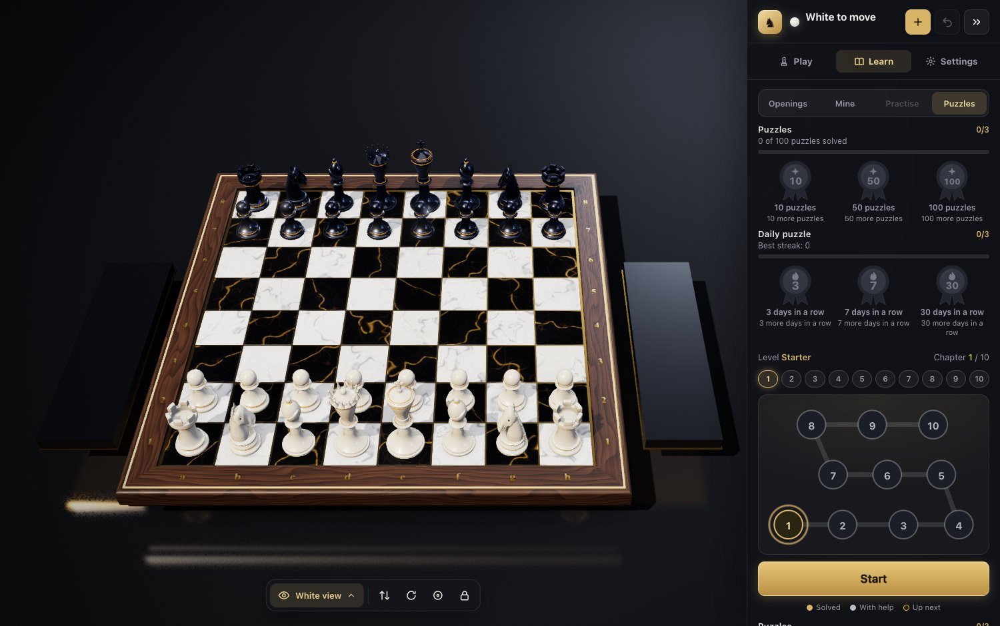

The Symbols view: flat chess diagram symbols as in chess books, on a plain board in the theme's colours.

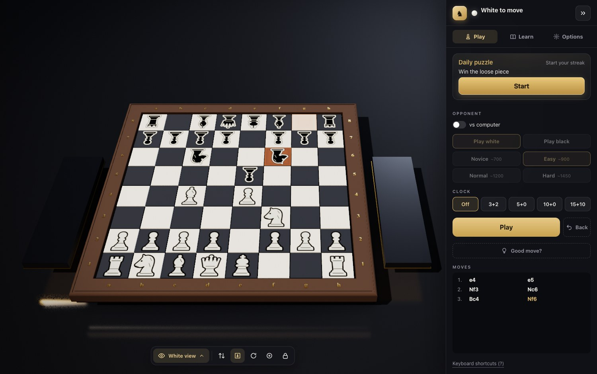

The Tournament theme (vinyl green and warm cream squares) and the Blocks theme (block heroes against block critters on a floating island).

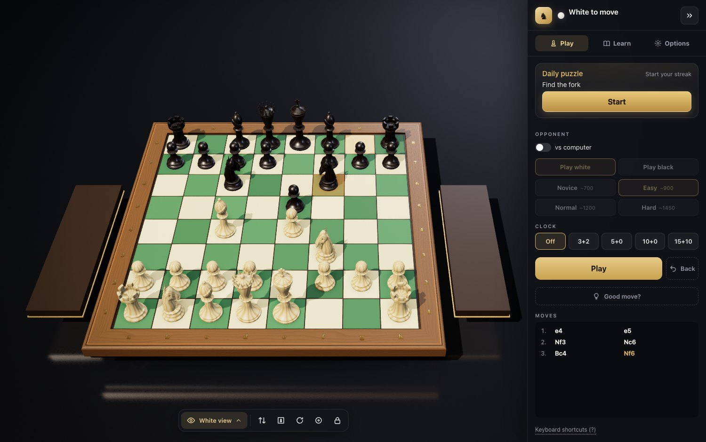

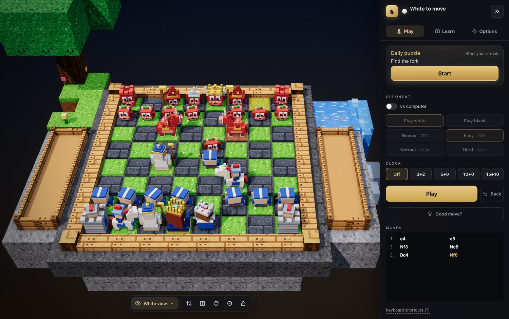

Game review after a game: a move strip with marked mistakes, a gold arrow for the better move and one sentence that says why. Details adds the evaluation graph, the best line and the accuracy of each side.

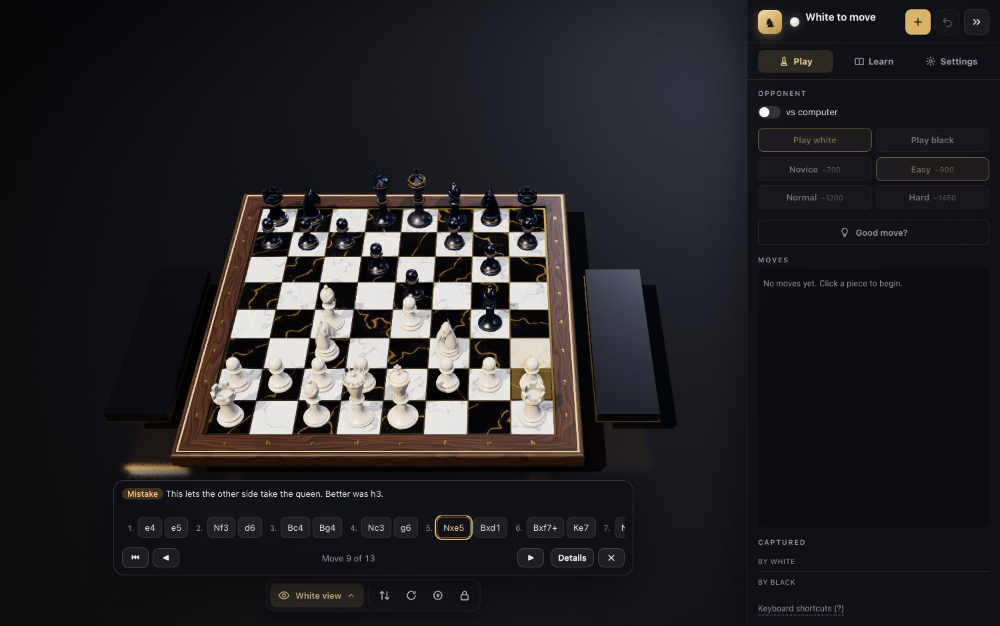

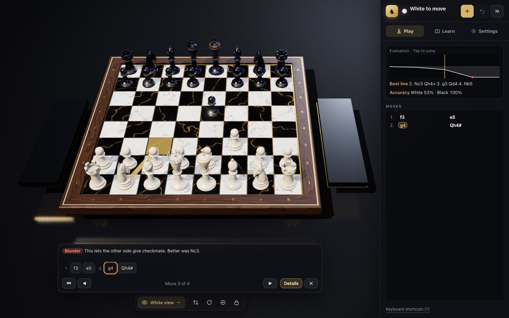

On a phone, in portrait: the game with its thumb bar, the Menu sheet, a lesson running with the learning bar, and the puzzle path.

  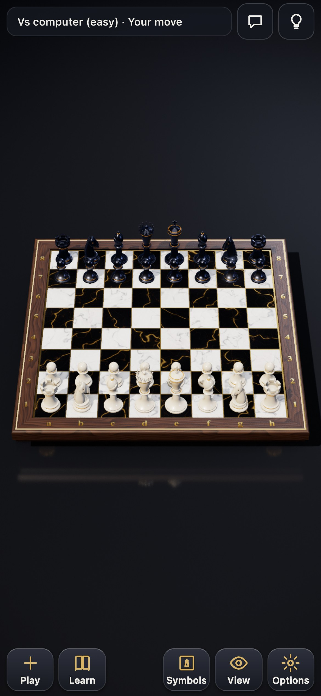
  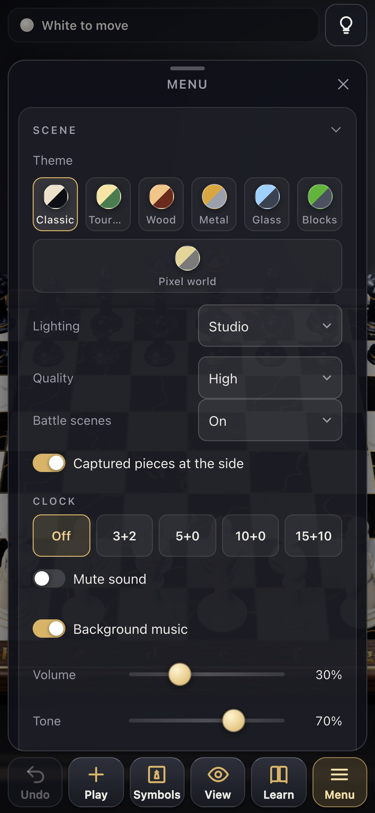
  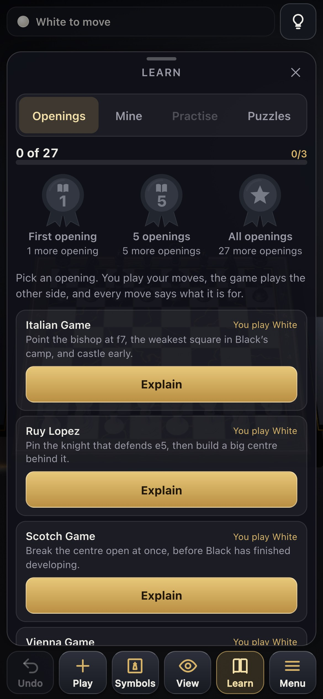
  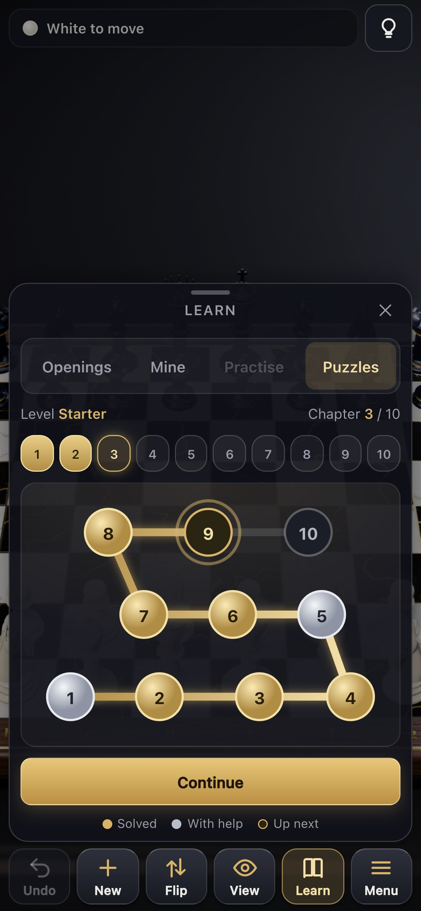

## Openings

The Learn tab (on a computer) and the Learn button (sixth button of the thumb bar on a phone, which opens the Learn sheet) have three tabs: Openings, Mine and Practise. The Openings tab teaches 27 lines, twelve classic openings and 15 side lines for the common replies you meet (Queen's Gambit Accepted and Slav, London against ...c5 and ...Bf5, Najdorf, Dragon and Alapin Sicilians, and so on). The twelve openings are: Italian Game, Ruy Lopez, Scotch Game, Vienna Game, King's Gambit, London System and Queen's Gambit as white, and Scandinavian Defense, Caro-Kann Defense, French Defense, Sicilian Defense and King's Indian Defense as black.

Pick a line and the board turns to your side. You play your own moves on the board and the game plays the other side after a short pause. Every move comes with one sentence that says what it is for. Any other move is refused and the card tells you which move the line plays.

- A gold marker shows the move you are about to play: a faint square where the piece stands, a strong square where it goes and an arrow between them. Hide the hint with the button on the card. The choice is kept in your browser.
- Show me plays the next move for you, Back returns to your previous move, and at the end of a line Again starts it over or you can choose another line.
- Leaving Openings starts a fresh ordinary game.

At the end of a line the button Add to my openings puts the line into your repertoire. A calm gold light runs once over the board and your pieces, and the button reads In my openings. Adopted lines carry a small gold mark in the Openings tab.

- Mine lists your adopted lines with a progress bar instead of the idea text, no numbers. Tap a line to walk it again. Edit and Done remove a line; its progress is kept in case you add it back.
- Practise (greyed until you have added your first line) is one thing: when positions are ready to be repeated it starts a session over them, otherwise it offers your lines for a whole run. You play your own moves, the other side is played for you. A wrong move slides back, the hint shows the right move and the sentence says what it is for, and you play it yourself. A session ends with the same gold light. A run of a whole line changes no progress.
- Your repertoire and progress are stored in the browser (one record, `chess3d.train`). Export and Import in the Menu (on a computer, in the Scene card) save and load it as a JSON file; an import that does not fit says what is wrong and changes nothing.

The line texts, names and the card are written in English and German. The EN and DE switch sits in the Settings tab (at the top of the Menu sheet on a phone). The language defaults to the browser's language and your choice is stored in the browser, not in the link. In German the move list and the line texts use the German piece letters (K, D, T, L, S).

## Puzzles

The Puzzles tab in the Learn sheet is a path of short tactics from the Lichess puzzle database: 300 easy ones in three levels (Einsteiger, Auf dem Weg, Knifflig in German; Starter, Growing, Tricky in English), mate in one and two, loose pieces and forks, one to three moves of your own. Each level is ten chapters of ten stations, easiest first, the themes mixed. The current chapter is a winding road of ten stations with the chapters as small badges above it. Press Start (later Continue): the board shows the opponent's last move and turns to your side, one line above the board says what to look for, and you play on the board.

- A wrong move slides back with a calm message, as often as you like. Help shows the gold arrow for the move.
- A station turns gold when you solve it with no miss and no Help, silver when it needed one (or you skipped it), and the path moves on either way. Tap any station to play it again: a silver one can turn gold, a gold one stays gold. Tap a chapter badge to look at another chapter. Nothing is locked.
- A finished chapter (all its stations gold or silver) opens the next one, with all stations lighting up in a wave; the last chapter of a level opens the next level. There is no automatic level change and no streak.
- Your openings Export and Import (Menu) carry the puzzle path too. Progress from the earlier puzzle version carries over: what you had solved is gold.
- Progress is kept in your browser (`chess3d.puzzles`), not in the link.
- Daily puzzle (Tagesrätsel): on the start screen (the top of the Play tab, on a phone the top of the Game section of the Menu) a card shows one puzzle per calendar day, the same for everyone, picked from the whole set by the local date alone (no server, no account; a new one at local midnight). Start plays it; a solve, clean or with help, marks the day (gold or silver) and the card then says "Heute gelöst". The streak ("3 Tage in Folge") counts consecutive solved days on this device and is kept in `chess3d.daily`; a missed day starts it again. The daily puzzle never changes the path. It is not part of Export and Import yet.

## Controls

Mouse

| Action | Input |
|---|---|
| Select a piece, then move it | Left click the piece, then a highlighted square. Click another own piece to switch, click elsewhere to deselect |
| Orbit the camera | Drag |
| Rotate the board (gimbal X and Y) | Shift + drag, Ctrl + drag, or right drag |
| Zoom | Mouse wheel |
| Reset one gimbal slider to 0 | Double click the slider |

Keyboard

| Key | Action |
|---|---|
| Q / E | Board roll (gimbal Z) |
| W / S | Board pitch (gimbal X) |
| A / D | Board yaw (gimbal Y) |
| Arrow keys | Orbit the camera |
| + / - | Zoom |
| 1 | White view |
| 2 | Black view |
| 3 | Top down |
| 4 | Side |
| 5 | Isometric |
| V | Top down |
| F | Flip to the other side of the board |
| R | Reset the view |
| Space | Auto spin on and off |
| U | Undo |
| N | New game |
| H | Fold the panel to the rail and unfold it (on a phone: hide and show the HUD) |
| ? or / | Keyboard shortcut overlay |
| Esc | Close the overlay, the game over banner or the promotion chooser |

The panel (computers and tablets): one panel on the right with the tabs Play, Learn and Settings, a header with the game status, New game and Undo, and a floating view bar over the board. The rail button (or H) folds the panel to a 60 px icon strip so the board gets the screen; the choice is remembered, and a window under 900 px wide starts as the rail. Starting a lesson or puzzle switches the panel to Learn. Choices are visible chips and swatches, not dropdowns. Phones keep the thumb bar and the Menu sheet.

Sliders and buttons (Settings tab; Flip, Spin, Reset and Lock are on the view bar)

| Control | What it does |
|---|---|
| Views | White view, Black view, Top down, Side, Isometric, plus four easy views: Symbols (flat chess diagram symbols as in chess books, cream and black with an outline, printed on a plain flat board in the theme's colours; free orbit), Tokens (a flat top view, every piece a thick turned disc with its Staunton silhouette in gold), From above (the real 3D pieces, perspective camera steeply from above at 65 degrees) and Easy 3D (a steep orthographic view, pieces about 1.15 times larger). The easy views show the board in the theme's full colour and as large as the screen allows (on a phone in portrait edge to edge); Tokens and From above lock the tilt and turn (Symbols and Easy 3D orbit freely), Flip, zoom and Reset still work. On phones in portrait also Play, the default there: the board as big as the screen allows, and the camera glides sideways so the selected piece and all its moves, the computer's reply and any hint arrow stay in view. Smooth animated transitions. The choice is remembered per device (a stored Easy flat from an older version becomes Tokens). The Views button on a phone cycles Play, Tokens, Symbols, From above, Easy 3D, then the presets. Tokens, Symbols and Easy 3D skip the battle scenes (From above plays them) |
| Flip, Spin, Reset | Turn to the other side, toggle auto spin, return to the start view |
| Board gimbal X, Y, Z | Three sliders from -180 to 180 degrees with a numeric readout, and a Level board button (Settings, under Advanced) |
| Theme | Classic, Tournament, Wood, Metal, Glass, Blocks: board, frame, pieces and lighting change together. Remembered on this device (Settings tab, or the Menu on a phone) |
| Lighting | Studio, Gallery, Sunset, Night |
| Quality | Low, Medium, High |
| New game, Undo, Keyboard shortcuts | Header buttons and the link at the foot of the Play tab (on a phone: the thumb bar and the Menu) |
| vs computer | On by default (you play white, Easy). Switch, your side (play white or black) and strength (Novice about 700, Easy about 900, Normal about 1200, Hard about 1450, estimated, see below; the choice is remembered on the device). In the Play tab, Good move? shows one good move with the hint arrow (a bulb in the status line on a phone) |
| Review the game | When a game ends, the card has a Review the game button (German: Partie ansehen) next to New game. Step back and forward through the whole game on a move strip under the board (above the thumb bar on a phone, arrow keys on a desktop; on a desktop the board makes room so the strip never covers it); mistakes are orange, blunders red. On a marked move the board shows the position before it, the gold arrow shows a better move and one friendly sentence says why. Details adds an evaluation graph (tap or drag to jump), the best line in notation and the accuracy of each side. The analysis is Hard's search in a Web Worker, so the strip fills in while you look |

Home Screen: on an iPhone or iPad the game can be added to the Home Screen from Safari (Share, then Add to Home Screen) and then runs full screen with its own icon (a web app manifest, no service worker). In a Safari tab it shows a short reminder with the three steps once after the first load, and at most twice more a few visits later. Later or a tap outside closes it at once. It never shows when the game is already installed, on desktop, or with any URL parameter below. The link preview used by chat apps and social sites is `public/og-image.png`.

Touch: a tap selects and moves (a tap just next to a legal square counts for it), a one finger drag orbits the camera, two fingers pinch to zoom and twist to turn the board, and the sliders tilt it. Lock view (the lock on the view bar, a switch in the Menu on a phone) stops all camera gestures. On a phone, while a lesson, a drill, a Practise session or a puzzle runs, the thumb bar turns into the learning controls (for example Back, Show me, Hint and End), the view stays on Play and a short text card sits on top; End gives the normal bar back. Otherwise the game has a status line on top, a thumb bar with big icons and one short word each (Undo, New, Flip, View, Learn, Menu), and a Menu sheet with the game settings, the move list, the view and the help. Portrait and landscape both work.

## Features

Rules

- Complete rules: castling (both sides, with the usual conditions), en passant, promotion with a chooser for queen, rook, bishop or knight, check, checkmate and stalemate
- Draws by the fifty-move rule, threefold repetition and insufficient material
- Move list in standard algebraic notation (SAN), captured pieces with the material balance, undo for any number of moves
- Play against the computer at four levels (Novice about 700, Easy about 900, Normal about 1200, Hard about 1450 estimated Elo), as white or black. The computer opponent is on by default, you play white on Easy. Switch it off in the Play tab (or open `?ai=0`) for two players on one screen
- The rules engine is checked against the standard perft node counts

Rendering

- A short start sequence: a king turns slowly, then the board builds itself. Skip it with `?intro=0`; it is also off with the system setting reduce motion
- Board of white and black marble squares in a walnut frame with a gold inlay, coordinate labels, a plinth and a captured-piece tray on each side of the board (pieces lie inside the tray, never overlapping, ordered by value; the Captured pieces at the side switch in the Scene card, or Menu on a phone, turns the trays off: a captured piece then fades out at the board edge, the camera fits the board alone, and the Captured list in the desktop Play tab appears (it is hidden while the trays show the pieces); the choice is kept per device)
- Sculpted Staunton pieces: a lathe turned pawn, rook, bishop, queen and king and a modelled knight head. 58k to 83k triangles per piece type
- Six themes (Classic, Tournament, Wood, Metal, Glass, Blocks), each one bundle of board squares, frame, inlay, pieces and lighting. The piece shapes stay, only materials and colours change (Tournament plays on vinyl green and warm cream squares like a club set). The textures are built on the first pick of a theme and freed again when you leave it. Glass uses real transmission only on the High quality tier; Low and Medium get a tinted lacquer look that costs nothing extra. Blocks is the exception to "the piece shapes stay": a floating block island with a grass and stone board, a plank frame, a tree that steps aside when it would stand in front of the board, a slow waterfall and drifting clouds that fade out behind the controls (all pixel textures drawn in code), with block heroes against block critters
- Four studio lighting presets: Studio, Gallery, Sunset and Night, with a smooth transition between them
- Quality tiers Low, Medium and High that change the shadow map size (1024, 2048 or 4096), the pixel ratio cap and the post chain
- Shadows, bloom, ambient occlusion (High tier), a vignette and grade pass, and a soft reflection of the pieces in the studio floor
- Board gimbal on X, Y and Z, independent of the camera orbit. The floor fades out when the board is tilted far from level

Battle scenes and sound

- When a piece captures in a game, the camera swoops in and the two pieces fight it out in a short scene that suits the attacker (pawn, knight, bishop, rook, queen or king), about three seconds, then the victim goes to its tray
- The Battle scenes setting (Scene card, or Menu on a phone) picks On, Short (about twice as fast) or Off; the choice is kept in your browser. A tap or any key skips a scene. Undo, New game and loaded positions never play one, nor does Openings
- Synthesised sound for moves, captures, check and the battle scenes, made in the browser with no audio files. The Mute switch sits next to Battle scenes and is remembered; sound starts only after your first tap or key
- Quiet piano music in the background, on by default, starting softly after your first tap or key: Satie (Gymnopédie No. 1, 2 and 3) and Bach (Prelude in C, the Air from the Orchestral Suite No. 3) in a random endless playlist with a few seconds of silence between pieces. The piano is synthesized in the browser (no audio files); the notes are public domain scores stored as data. Sound effects and battle scenes dip it, it pauses when the tab is hidden, and Mute silences everything. The Music switch and the sliders Volume, Tone (bright to warm), Tempo (0.8x to 1.1x) and Room (reverb) sit below Mute (Scene card, or Menu on a phone) and are remembered per device. Scores are the public domain typesettings of the Mutopia Project (mutopiaproject.org), credited in the header of each piece in src/music/pieces

Limits: there is no network play. Two people share one screen (computer off), or you play the computer.

Browser support: needs WebGL 2. The build targets Safari 15 and later, and current Chrome, Edge and Firefox. It was tested in Chrome only. If the script cannot start (an old browser, a failed download), the loading screen says so after 20 seconds instead of waiting forever.

## URL parameters

All optional. They are meant for screenshots and tests, but work for anyone.

| Parameter | Value | Effect |
|---|---|---|
| `quality` | `low`, `medium`, `high` | Start in this quality tier (default `high`, `medium` on touch devices) |
| `touch` | `1`, `0` | `1` forces touch mode on (Medium start tier, page gesture blocking), `0` forces it off (desktop behaviour even on a touch device). Without it touch is detected from the primary input. An explicit `quality` wins over the touch start tier |
| `light` | `Studio`, `Gallery`, `Sunset`, `Night` | Start with this lighting preset |
| `theme` | `classic`, `tournament`, `wood`, `metal`, `glass`, `blocks` | Start with this theme for this load only (the swatch row remembers the theme you pick, in `localStorage` `chess3d.theme`) |
| `view` | `white`, `black`, `top`, `side`, `iso`, `tokens`, `symbols`, `above`, `easy-3d`, `play` | Start in this view for this load only (without it the remembered view, or the device default). `play` only exists on a phone in portrait |
| `preset` | `White view`, `Black view`, `Top down`, `Side`, `Isometric` | Jump to a view preset |
| `yaw`, `pitch` | degrees | Set the camera angles |
| `dist` | number | Set the camera distance |
| `gx`, `gy`, `gz` | degrees | Set the board gimbal on X, Y, Z |
| `fen` | FEN string | Load a position |
| `moves` | `e2e4,e7e5,g1f3` | Play these moves after `fen` (the start position if there is none). Comma separated, from and to square, with a fifth letter for a promotion such as `e7e8q` |
| `select` | square, for example `e2` | Select the piece on this square |
| `promo` | four letters, for example `a7a8` | Click this move, which opens the promotion chooser |
| `trays` | `0`, `1` | Capture trays at the side of the board: `0` off, `1` on, for this load only (the Captured pieces at the side switch remembers your choice in `localStorage` `chess3d.trays`; the flag beats it) |
| `ai` | `0`, `1`, `2`, `3`, `4` | The computer opponent is on by default (plays black, Easy). `ai=0` turns it off for two players, `ai=1` is Novice, `ai=2` Easy, `ai=3` Normal, `ai=4` Hard (a level given here beats the remembered one) |
| `spin` | `1` | Start with auto spin on |
| `hud` | `0` | Start with the HUD hidden |
| `help` | `1` | Open the keyboard shortcut sheet |
| `diag` | `1` | Show the on device diagnostics box (frames per second, frame times, quality tier, pixel ratio, an estimated graphics memory figure, touch mode). Tap it to expand or collapse. Off by default and nothing of it loads without the flag. `bin/device-check --diag` adds it to the URL it prints |
| `manual` | `1` | No render loop. Tests step time with `__chess.step(seconds)` and draw with `__chess.draw()`. Also switches the start sequence off |
| `intro` | `0`, `1` | `0` skips the start sequence (the turning king and the board building itself). `1` keeps it with `manual=1`, where a test drives it with `__intro.tick(seconds)`. It is also off with the system setting reduce motion, then the finished board shows at once |
| `open` | `learn`, `openings`, `mine`, `drill`, `practise`, `puzzles`, `daily`, `settings`, `music`, `scene`, `moves` | Open this panel or tab once the game is ready (after the start sequence). One value per load. `learn` and `openings` show the Learn tab Openings, `mine`, `practise` and `puzzles` their tabs (`drill` is the Practise tab, which is locked until you have added an opening), `settings` and `scene` the Scene card (on a phone the Menu sheet with it open), `music` the music settings inside it, `moves` the move list, `daily` the Daily puzzle card (the Play tab on desktop, the Game section of the Menu sheet on a phone) without starting it. On a phone the Learn values open the Learn sheet and the others the Menu sheet. An unknown value is ignored without a message. Combines with the other flags, for example `?view=tokens&open=puzzles` |
| `daily` | `YYYY-MM-DD`, for example `2026-10-03` | Pretend this date is today for the Daily puzzle: it picks that date's puzzle and the streak counts from it (for tests and the release test page; an invalid value is ignored). Solving writes only that date's own record into `localStorage` `chess3d.daily` |

Example: `?ai=0&preset=Isometric&light=Sunset&moves=e2e4,e7e5,g1f3,b8c6`

## Development

Requires Node 20 or newer.

    npm install
    npm run dev        # http://localhost:5173
    npm run build      # production bundle in dist/
    npm run preview    # serve dist/ on http://localhost:4173

The build uses relative asset paths (`base: './'`), so `dist/` can be hosted from any folder or sub path.

Tests come in four tiers:

    node test/run.mjs            # fast, no browser: rules perft, piece geometry contract, text lint, audit planner rules, openings, puzzles (progress, controller, data), novice level, training core (this is npm test)
    node test/run.mjs smoke      # smoke, about 2 minutes on a quiet machine for all groups: build, serve, drive the real page in headless Chrome, then the battle scenes (test/battle.mjs). In a lane worktree only the groups the diff against main affects run (--all for every group, --no-cache to ignore cached passes)
    node test/run.mjs phone      # phone, several minutes: phone sizes, tap target audit, real multi touch, the Add to Home Screen reminder
    node tools/release-check.mjs # release: fresh build, page load (GPU, plus a software pass that only warns), hostile URLs, docs and repo hygiene

The phone tier loads the page as an iPhone at five screen sizes (portrait, landscape and short landscape views), audits every tap target for the 44 px minimum and drives real multi touch events: tap, pinch, twist and the thumb bar. The smoke tier plays a scripted game with real pointer clicks (capture, castling, en passant, promotion, a mate, undo, the computer reply), walks an opening line to its end, moves each gimbal slider, checks the render budgets and checks the canvas pixels in every view preset. `test/views.mjs` (part of the smoke tier) opens every view at four screen sizes and checks projection, picking with real clicks, legal target squares on screen, the remembered choice and the piece scale. The browser tiers use puppeteer-core with a locally installed Google Chrome, which renders with a software GL in headless mode (on Apple Silicon it uses the GPU, `CHESS_GL=swiftshader` forces software; builds and passed smoke groups are cached by content in `~/.cache/chess-3d`). For that reason there are no golden image comparisons: the pixels differ between machines. Look at the screenshots instead.

The icons and the link preview are regenerated with `node tools/render-assets.mjs final --icon=float` (see `tools/README.md`). To look at the game on a real phone with the diagnostics box, run `bin/device-check --diag`.

`node tools/audit-plan.mjs` lists which of these checks a change needs, from the files changed since the last release.

A GitHub Actions workflow (`.github/workflows/pages.yml`) runs the fast test tier, then builds the site and deploys it to GitHub Pages on every push to `main`. If a test fails, nothing is deployed.

The module layout and the APIs between modules are in [docs/ARCHITECTURE.md](docs/ARCHITECTURE.md).

## Known issues

- The marble and walnut textures are 1024 px (512 px on phones and Low quality, made once and cached in the browser), so extreme close-ups look soft.
- Frame rate on real GPUs is unmeasured beyond the author's machine. Tested mainly on software and Apple silicon GPUs.

## Licence

MIT, see [LICENSE](LICENSE). Uses [three.js](https://threejs.org/), also MIT, copyright the three.js authors.

The puzzles are taken from the [Lichess puzzle database](https://database.lichess.org/#puzzles), released under CC0 (public domain).

## Computer strength

The ratings shown next to the levels are estimates. Each level was played for 30 games against Stockfish 19 limited to its lowest rating setting (UCI_Elo 1320, 60 ms per move), alternating colours from random openings: Easy scored 2.5/30, Normal 9.5/30 and Hard 20/30, which puts them at roughly 900, 1200 and 1450 on that scale. The error is about 100 points either way, and Stockfish's rating scale is not the same as online or club ratings, so read them as a guide to the ordering and spacing of the levels rather than a rating you would hold on a chess site. Playing against each other the gaps are wider: Hard beat Normal 27 games to 0 with 3 draws.

Novice was measured differently, because there is no Stockfish on the machine it was tuned on: only against Easy, 180 games over three runs of 60 (alternating colours, four random opening plies), where it scored 41 of 180 points (about 23 percent). That is about 210 points below Easy, so about 690 on the scale above. The error is larger than for the others: about 50 points for one standard deviation, 100 for two, on top of the error of Easy's own rating. Novice searches as deep as Easy, plays a random move from the weaker half of its options one time in ten, and always takes a piece left hanging. Hard, Normal and Easy have not been re-measured.
